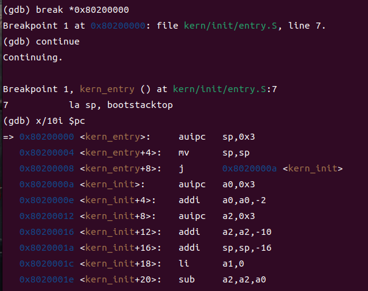
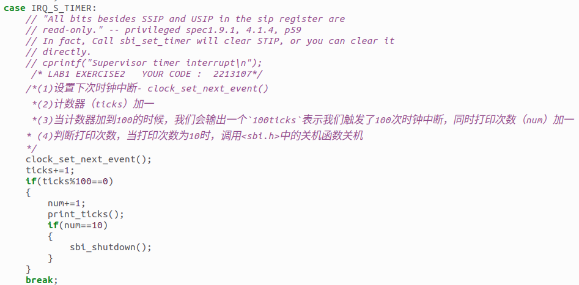
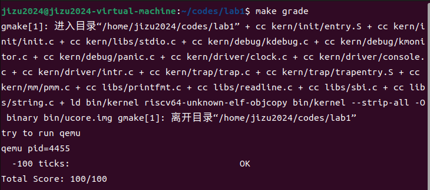
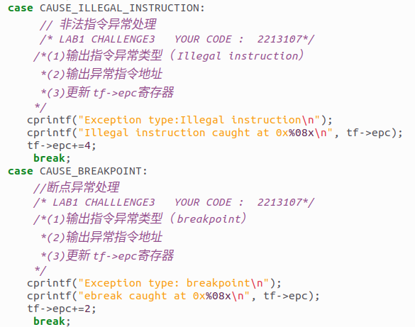
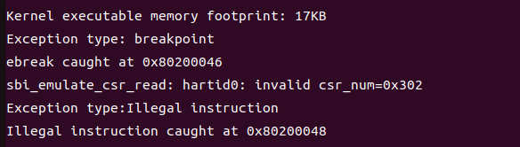

# 最小可执行程序与中断处理——实验报告
## Lab0.5
### 练习1: 使用GDB验证启动流程
#### 练习过程
- 启动 QEMU 和 GDB
在实验中，我们首先需要通过 `make debug` 启动 QEMU 并进入调试模式，然后使用 GDB 附加到 QEMU 进程中。

- RISC-V硬件加电后的几条指令

- 设置断点，模拟执行

#### 加电后的几条指令地址及其功能

##### 初始指令地址

在 RISC-V 系统的 QEMU 模拟环境下，加电后的指令从地址 0x1000 开始执行。该地址处的指令主要用于硬件的初始化操作，例如设置寄存器、加载线程 ID，并准备跳转到操作系统内核或固件入口地址。

##### 功能

- __CPU 初始化__：通过初始的几条指令，RISC-V CPU 完成了硬件的基础初始化，包括设置寄存器和加载一些基本的系统状态。指令如 `auipc t0, 0x0` 和 `addi a1, t0, 32` 用来计算内存地址，而指令 `csrr a0, mhartid` 则读取硬件线程 ID，用于多核处理器识别当前核。

- __跳转到内核入口或固件__：通过运行指令 `jr t0`，系统将跳转到寄存器 `t0` 中存储的地址。在大多数情况下，这个地址指向固件或操作系统内核的入口。例如，从地址 0x1000 开始的初始化流程最终会跳转到 0x80000000，这是固件的入口地址。固件初始化完成后会将控制权交给操作系统的内核入口地址 0x80200000，然后开始执行内核代码。

##### 总结
RISC-V硬件加电后执行的主要功能分为以下三点：
- Qemu载入相关文件，实现地址跳转
- Bootloader的加载：即作为 bootloader 的 OpenSBI.bin 被加载到物理内存以物理地址 0x80000000 开头的区域上，同时内核镜像 os.bin 被加载到以物理地址 0x80200000 开头的区域上
- 内核的执行

- ## Lab1

### 练习1：理解内核启动中的程序入口操作

#### 指令 `la sp, bootstacktop`的作用和目的：

将内核栈的顶部地址加载到栈指针寄存器`sp`中，目的是在操作系统启动时，初始化栈指针，确保栈指针指向内核栈的顶部，确保内核在执行过程中有可用的栈空间，并且栈的操作能够正确进行。

#### `tail kern_init`的作用和目的：

执行`kern_init`函数，对内核进行初始化。使用`tail`进行跳转，会清除当前函数的栈帧，同时将控制权传递给另一个函数，避免了创建新的栈帧，这样做可以节省栈空间。

### 练习2：完善中断处理

根据代码提示将代码补全如下：

在这个函数中，先调用`clock_set_next_event`设置时钟中断，并在中断发生后增加计数器，如果计数器达到了整百的数，就执行一次print命令并增加num，当执行了10次print后，使用`sbi_shutdown`进行关机操作。

执行`make grade`后结果如下：

### 扩展练习 
#### Challenge1
##### 描述与理解中断流程

观察trap.c和trapentry.S可以得知，在异常或中断发生时，首先会使用SAVE_ALL保存所有寄存器的值，再通过`move a0, sp`命令将栈指针的值移动到a0寄存器，再调用异常处理函数`trap_dispatch`函数判断是应该调用中断处理函数还是异常处理函数，通过`exception_handler`或`interrupt_handler`函数进行操作，最后通过RESTORE_ALL恢复所有寄存器的值。

##### `mov a0，sp`的目的：

这样做的目的是为了将当前的栈指针传递给中断处理函数，当一个中断发生时，内核需要知道中断发生时的上下文环境，而栈指针是这个上下文中非常重要的一部分。通过将栈指针传递给中断处理函数，内核可以访问到中断发生时的完整上下文信息。

##### SAVE_ALL中寄存器保存在栈中的位置：

首先用`csrw sscratch, sp`将当前的栈指针写入 `sscratch` 寄存器。其他寄存器的保存位置由偏移量决定的，`STORE x, x*REGBYTES(sp)`表示第x个寄存器保存到偏移量为`x*REGBYTES(sp)`的地方。

注意，在保存所有寄存器时，需要先将`sp`的值保存到`sscratch`中，然后利用`addi sp, sp, -36`更新栈顶，创建大小为36的栈帧，以放入一个`trapFrame`结构体，随后利用`sp`的值来保存除`x2`以外所有寄存器的值（因为`x2`就是`sp`，而我们需要保存的`sp`的值已经事先存到`sscratch`中了），最后保存`sscratch`、`sstatus`、`sepc`、`sbadaddr`、`scause`几个寄存器（其中`sscratch`里面就是需要保存的`sp`，即`x2`中的值）。

##### 对于任何中断，__alltraps 中是否都需要保存所有寄存器：

`x0`寄存器其实可以不用存储，因为其应该始终保持0.

#### Challenge2：理解上下文切换机制

##### `csrw sscratch, sp`和 `csrrw s0, sscratch, x0`的作用：

`csrw sscratch, sp`将当前的栈指针的值写入控制状态寄存器 `sscratch`，在发生异常或中断处理时保存原始的栈指针，以便之后可以恢复到异常发生时的上下文。

`csrrw s0, sscratch, x0`首先将` sscratch `寄存器的值读取到 `s0`，再将`sscratch`置0，目的是为了在发生异常或中断时，能够保存 `sscratch` 的原始值，以便之后可以恢复。

##### 保存sbadvaddr和scause的作用：

`sbadvaddr`保存了导致异常的虚拟地址，`scause`保存导致异常的具体原因。保存这些CSR的值是为了在异常处理程序中能够访问到异常发生时的上下文信息。但是在异常处理完成后，这些值就不重要了，因为异常应该已经被处理了，所以可以不再restore。

#### 扩展练习Challenge3：完善异常中断

根据提示代码修改如下：

先输出发生的异常类型和异常指令地址，再根据不同异常的类型更新`tf->epc`寄存器，以跳过异常指令。

执行结果如下图：

