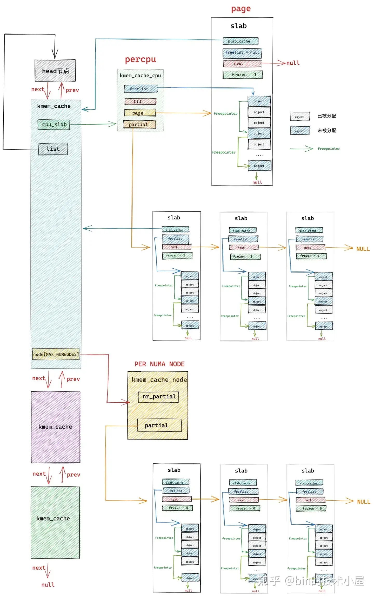

# Lab2实验报告——物理内存和页表
## 一、实验目的

- 理解页表的建立和使用方法
- 理解物理内存的管理方法
- 理解页面分配算法

​实验一过后我们做出来了一个可以启动的系统，实验二主要涉及操作系统的物理内存管理。操作系统为了使

用内存，还需高效地管理内存资源。本次实验我们会了解如何发现系统中的物理内存，然后学习如何建立对

物理内存的初步管理，即了解连续物理内存管理，最后掌握页表相关的操作，即如何建立页表来实现虚拟内

存到物理内存之间的映射，帮助我们对段页式内存管理机制有一个比较全面的了解。本次的实验主要是在实

验一的基础上完成物理内存管理，并建立一个最简单的页表映射

## 二、练习

### 练习1：**理解首次适应（First-Fit）连续物理内存分配算法**

在深入分析了 `kern/mm/default_pmm.c` 文件中的相关代码后，我们对 `default_init`、`default_init_memmap`、`default_alloc_pages` 和 `default_free_pages` 等函数的功能进行了简要讨论，并阐述了这些函数在物理内存分配过程中的具体作用。

#### `default_init` 函数：
`free_list` 是一个 `list_entry` 结构的双向链表指针，用于管理空闲内存块。`nr_free` 变量则用于记录当前可用的空闲页数。该函数的主要任务是初始化这个链表，并将可用内存页数设置为0，表示系统开始时没有任何空闲页块可供使用。

#### `default_init_memmap` 函数：
`default_init_memmap` 函数负责根据 `page_init` 函数传递的参数（包括空闲内存块的起始页和页数），将这些空闲块构建为一个双向链表。链表的头指针为 `free_area->free_list`，链表项为 `Page` 数据结构中的 `base->page_link` 成员。假定这些空闲块是按地址从低到高的顺序传递的，因此通过这个链表结构可以管理整个连续的空闲内存区域。

#### `default_alloc_pages` 函数：
此函数负责从空闲链表中分配页块。First-Fit 算法要求从链表头开始，逐块检查空闲内存区域。通过 `list_next` 函数遍历链表，并使用 `le2page` 宏获取每个链表节点对应的 `Page` 结构体指针 `p`。如果 `p->property` 的值大于或等于请求的页数 `n`，则表示该块可以满足请求，函数将调整链表并返回这个分配的页块。

#### `default_free_pages` 函数：
`default_free_pages` 函数实现了内存块的释放和合并。当内存块被释放时，需要将其与相邻的空闲块进行合并，以减少内存碎片。这个函数根据释放块与周围空闲块的位置关系，处理三种情况：释放块紧邻下一个空闲块、释放块紧邻前一个空闲块、以及释放块周围没有其他空闲块。合并完成后，将新的空闲块重新加入空闲链表。


#### QA: 你的 first fit 算法是否有进一步的改进空间？

首次适应算法（First Fit）虽然是一种相对简单且常见的内存分配方法，但在性能和效率方面仍有改进的空间。以下是一些可能的优化思路：

1. **优化搜索过程**：
   - 在处理大型系统时，遍历空闲内存链表可能会造成显著的性能问题。为此，可以考虑使用**平衡二叉树**或其他更高效的数据结构来加速搜索。不过，**构建平衡树的代价也需要纳入考虑**，因此需要权衡利弊。

2. **延迟内存块合并**：
   - 当释放内存时，可以选择不立即进行内存块合并，而是通过定期触发合并操作来减少频繁合并带来的开销，进而提升在高负载情况下的性能表现。

3. **分层管理内存**：
   - 可以将内存按不同大小进行分层，每一层包含特定大小的块。类似**多级链表**的结构可以帮助快速找到适合的内存块，降低搜索所需的时间。

4. **提前分配和释放**：
   - 根据系统的历史使用数据和当前负载模式，提前预测未来的内存需求和释放情况，并提前执行这些操作，从而提高内存分配的效率。

5. **应用缓存机制**：
   - 对于频繁分配和释放的小内存块，可以引入**缓存**机制，以加快这些操作的速度，减少不必要的内存分配和释放过程。


### 练习2：**最佳适应（Best-Fit）连续物理内存分配算法**

Best-Fit 算法通过遍历整个空闲链表，选择满足要求的最小空闲块，从而尽量减少内存碎片。相比于 First-Fit 算法，它更关注内存利用率，但由于需要遍历整个链表，时间复杂度较高。以下是具体的实现及其分析：

#### `struct Page` 结构体说明：
`struct Page` 是操作系统用于描述物理页的关键数据结构。它包含页的引用计数、标志信息、页块的大小以及双向链表指针。具体定义如下：

```c
struct Page {
    int ref;                       // 页的引用计数
    uint64_t flags;                // 页的标志，用于表示该页的状态
    unsigned int property;         // 表示空闲页块的大小
    list_entry_t page_link;        // 双向链表指针，链接空闲页块
};
```

#### `best_fit_init_memmap` 函数：
该函数负责初始化连续空闲页块，并将其插入空闲链表中。链表中的页块按照地址顺序排列，系统会根据页块的大小和地址位置，将其插入到合适的位置。首先清空页的属性并初始化页块，然后通过比较页块的地址，找到合适的位置进行插入。具体代码如下：
```c
static void
best_fit_init_memmap(struct Page *base, size_t n) {
    assert(n > 0);
    struct Page *p = base;
    for (; p != base + n; p ++) {
        assert(PageReserved(p));

        /*LAB2 EXERCISE 2: 2213748*/ 
        // 清空当前页框的标志和属性信息，并将页框的引用计数设置为0
        p->flags = p->property = 0;
        set_page_ref(p, 0);
    }
    base->property = n;
    SetPageProperty(base);
    nr_free += n;
    if (list_empty(&free_list)) {
        list_add(&free_list, &(base->page_link));
    } else {
        list_entry_t* le = &free_list;
        while ((le = list_next(le)) != &free_list) {
            struct Page* page = le2page(le, page_link);
             /*LAB2 EXERCISE 2: 2213748*/ 
            // 编写代码
            // 1、当base < page时，找到第一个大于base的页，将base插入到它前面，并退出循环
            // 2、当list_next(le) == &free_list时，若已经到达链表结尾，将base插入到链表尾部
            if (base < page){
                list_add_before(le, &(base->page_link));
                break;
            }
            else if (list_next(le) == &free_list){
                list_add_after(le, &(base->page_link));
            }
        }
    }
}
```

#### `best_fit_alloc_pages` 函数：
该函数负责在空闲链表中查找最小的满足条件的页块。相比于 First-Fit，Best-Fit 算法会遍历整个链表，选择最适合的空闲块。具体实现中，通过比较 property 值，找到大小最接近需求的块，并将其分配出去。
```c
static struct Page *
best_fit_alloc_pages(size_t n) {
    assert(n > 0);
    if (n > nr_free) {
        return NULL;
    }
    struct Page *page = NULL;
    list_entry_t *le = &free_list;
    size_t min_size = nr_free + 1;
     /*LAB2 EXERCISE 2: 2213748*/ 
    // 下面的代码是first-fit的部分代码，请修改下面的代码改为best-fit
    // 遍历空闲链表，查找满足需求的空闲页框
    // 如果找到满足需求的页面，记录该页面以及当前找到的最小连续空闲页框数量
    while ((le = list_next(le)) != &free_list) {
        struct Page *p = le2page(le, page_link);
        if (p->property >= n && p->property < min_size) {
            min_size = p->property;
            page = p;
        }
    }

    if (page != NULL) {
        list_entry_t* prev = list_prev(&(page->page_link));
        list_del(&(page->page_link));
        if (page->property > n) {
            struct Page *p = page + n;
            p->property = page->property - n;
            SetPageProperty(p);
            list_add(prev, &(p->page_link));
        }
        nr_free -= n;
        ClearPageProperty(page);
    }
    return page;
}
```
#### `best_fit_free_pages` 函数：
该函数用于释放页块并将其重新插入空闲链表中。在合并空闲页块时，Best-Fit 算法会通过地址比较，确保新释放的页块能够合并到合适的位置，以最大化减少内存碎片。
```c
static void
best_fit_free_pages(struct Page *base, size_t n) {
    assert(n > 0);
    struct Page *p = base;
    for (; p != base + n; p ++) {
        assert(!PageReserved(p) && !PageProperty(p));
        p->flags = 0;
        set_page_ref(p, 0);
    }
    /*LAB2 EXERCISE 2: 2213748*/ 
    // 编写代码
    // 具体来说就是设置当前页块的属性为释放的页块数、并将当前页块标记为已分配状态、最后增加nr_free的值
    base->property = n;
    SetPageProperty(base);
    nr_free += n;

    if (list_empty(&free_list)) {
        list_add(&free_list, &(base->page_link));
    } else {
        list_entry_t* le = &free_list;
        while ((le = list_next(le)) != &free_list) {
            struct Page* page = le2page(le, page_link);
            if (base < page) {
                list_add_before(le, &(base->page_link));
                break;
            } else if (list_next(le) == &free_list) {
                list_add(le, &(base->page_link));
            }
        }
    }

    list_entry_t* le = list_prev(&(base->page_link));
    if (le != &free_list) {
        p = le2page(le, page_link);
        /*LAB2 EXERCISE 2: 2213748*/ 
         // 编写代码
        // 1、判断前面的空闲页块是否与当前页块是连续的，如果是连续的，则将当前页块合并到前面的空闲页块中
        // 2、首先更新前一个空闲页块的大小，加上当前页块的大小
        // 3、清除当前页块的属性标记，表示不再是空闲页块
        // 4、从链表中删除当前页块
        // 5、将指针指向前一个空闲页块，以便继续检查合并后的连续空闲页块
        if (p + p->property == base){
            p->property += base->property;
            ClearPageProperty(base);
            list_del(&(base->page_link));
            base = p;
        }
    }

    le = list_next(&(base->page_link));
    if (le != &free_list) {
        p = le2page(le, page_link);
        if (base + base->property == p) {
            base->property += p->property;
            ClearPageProperty(p);
            list_del(&(p->page_link));
        }
    }
}
```
#### 测试结果：


#### QA: 你的 Best-Fit 算法是否有进一步的改进空间？

类似于 First Fit，Best-Fit 算法的优化方向可以包括：搜索过程的提升、延迟合并策略、分层管理内存、预分配和预释放、以及引入缓存机制等。这些方法都可以有效提升算法的效率和内存管理性能。

此外，由于 Best-Fit 需要遍历整个空闲链表，当链表长度过长时会导致时间开销较大。因此，可以考虑结合 First-Fit 的方法，只遍历到合适的页块后立即停止，以加快分配速度。

## 三、Challenge

### Challenge 1——buddy system（伙伴系统）分配算法

#### 1、buddy分配算法实现功能
将内存按2的幂进行划分，从而减少内存碎片，其初始化时需要分配的内存大小为2的n次幂。

在内存分配过程中，首先需要寻找大于等于所需大小并且最接近2的幂的大小的内存块，然后如果能找到大小刚好一致的就直接分配，否则就对大块进行对半分割，分割后重复进行以上操作，直到获得大小合适的块。

在内存释放过程中，在释放内存块后，会寻找相邻的块，看其是否释放了，如果相邻块也释放了，合并这两个块，重复上述步骤直到遇上未释放的相邻块。

#### 2、实现思路

全局变量 `freelist`（`list_entry_t free_list`）： 是一个双向链表，用于维护所有空闲的内存块。在初始化时，`freelist` 中的每个节点都代表一个空闲的内存块。链表的节点存储了指向物理页的指针（`struct Page*`），链表中的property项表示当前可用的空闲页数。这个链表用于在分配内存时查找可用的空闲块，以及在释放内存时将空闲块添加回链表中。

buddy_init_memmap和default_init_memmap一致，唯一需要注意的是需要将需要分配的内存大小转化为不超过它的最接近2的幂的大小。

buddy_alloc_pages函数接收1个参数n,表示所需要分配的内存页数,实现如下:
```c
assert(n > 0);
size_t u=fixsize(n);
if (u > nr_free) {
    return NULL;
}
```

首先对于输入的n进行判断其是否合法,然后将其转化为大于等于n并且最接近的2的幂。
```c
struct Page *page = NULL;
list_entry_t *le = &free_list;
size_t min_size=1e9;
while ((le = list_next(le)) != &free_list) {
    struct Page *p = le2page(le, page_link);
    if (p->property >= u&&min_size>p->property) {
        page = p;
        min_size=page->property;
    }
}
```
然后寻找大于n大小的且最小的数据块
```c
if (page != NULL) 
{
    while(page->property>=2*u)
    {
        list_entry_t* prev = list_prev(&(page->page_link));
        list_entry_t* next = list_next(&(page->page_link));
        list_del(&(page->page_link));
        struct Page *p = page + page->property/2;
        struct Page *q = page;
        p->property=page->property/2;
        q->property=page->property/2;
        SetPageProperty(p);
        SetPageProperty(q);
        list_add(prev, &(q->page_link));
        list_add_before(next, &(p->page_link));
        page=q;
    }
    list_del(&(page->page_link));
    nr_free -= page->property;
    ClearPageProperty(page);
}
return page;
```
最后,如果存在这样的页,就考虑它的大小是否刚刚好,如果大于所需大小,就对其进行分割,并将分割后的块放回链表中,直到出现大小合适的块,此时将其从链表中删去,同时减少内存可用空间并将page返回.

buddy_free_pages函数接收两个参数,base为需要回收的内存块,n为其大小,实现方式如下:
```c
assert(n > 0);
n=fixsize(n);
struct Page *p = base;
for (; p != base + n; p ++) {
    assert(!PageReserved(p) && !PageProperty(p));
    p->flags = 0;
    set_page_ref(p, 0);
}
base->property = n;
SetPageProperty(base);
nr_free += n;
if (list_empty(&free_list)) {
    list_add(&free_list, &(base->page_link));
} 
else {
    list_entry_t* le = &free_list;
    while ((le = list_next(le)) != &free_list) {
        struct Page* page = le2page(le, page_link);
        if (base < page) {
            list_add_before(le, &(base->page_link));
            break;
        } 
        else if (list_next(le) == &free_list) {
            list_add(le, &(base->page_link));
        }
    }
}
```
先对输入的n进行判断,将其修正为大于n且最小的2的幂,释放从base开始的大小为n的数据块,并将其添加回链表中的合适位置.
```c
size_t flag=1;
struct Page *q=le2page(list_next(&free_list),page_link);
while(flag==1)
{
    if(((base-q)/base->property)%2==1)
    {
        list_entry_t* le = list_prev(&(base->page_link));
        if (le != &free_list) {
            p = le2page(le, page_link);
            if (p + p->property == base && p->property==base->property) {
                p->property += base->property;
                ClearPageProperty(base);
                list_del(&(base->page_link));
                base = p;
            }
            else flag=0;
        }
        else flag=0;
    }
    else if(((base-q)/base->property)%2==0)
    {
        list_entry_t* le = list_next(&(base->page_link));
        if (le != &free_list) {
            p = le2page(le, page_link);
            if (base + base->property == p && p->property==base->property) {
                base->property += p->property;
                ClearPageProperty(p);
                list_del(&(p->page_link));
            }
            else flag=0;
        }
        else flag=0;
    }
}
```
考虑它应该如何与相邻项进行合并,链表中第2n项应该与2n+1项合并,而不应该考虑与2n-1项合并,否则可能导致第2和第3项合并后第1项找不到可合并的块的问题.合并操作主要包括延长靠前块的可用长度并从链表中删去靠后项.

#### 3、测试结果
使用的测试函数如下
```c
struct Page *p0, *A, *B, *C, *D;
p0 = A = B = C = D = NULL;
A = alloc_pages(70);
B = alloc_pages(35);
C = alloc_pages(257);
D = alloc_pages(63);
free_pages(B, 35);
free_pages(D, 63);
free_pages(A, 70);
A = alloc_pages(511);
free_pages(A, 511);
A = alloc_pages(255);
B = alloc_pages(255);
free_pages(C, 257);
free_pages(A, 255);
free_pages(B, 255);  
```

测试的流程如图所示(因为只涉及前1024页,所以仅展示前1024页的空间结构,其中红色代表被使用的区块,数字代表区块大小)


测试结果如下图所示:


可以验证算法正确.

### Challenge 2——slub算法

#### 1、前言(小吐槽)

实验指导手册里面直接给出了一个去往代码仓库的链接，代码足足有7446行，根本看不完也看不明白！
为此，我去网上找了一些博客资料（类似于伙伴系统里面的那种），我认为讲的比较清楚，展示在下面:

##### 究极详细的博客: `https://segmentfault.com/a/1190000043626203#item-9 `（这篇博客的上一篇就是将伙伴系统的，讲的也很详细，强力推荐给学弟学妹们这篇文章作参考）

##### 这篇博客里面也有详细图解: `https://www.cnblogs.com/LoyenWang/p/11922887.html`

##### 这篇B站图文讲解也可以，但是不如其他详细: `https://www.bilibili.com/read/cv35002973/`

由于本算法的简化版依然比较复杂，因此我并没有给出完整的代码，而是把已经完成的片段代码方在了下面的实验报告中。由于slub算法本身就很复杂，简化的方式也比较复杂，因此本篇的篇幅会比较长，敬请谅解。

#### 2、整体设计思想

由于利用伙伴系统分配内存空间时，不满一页均按照一页的大小分配，因此在分配不足4K的内存时会出现大量浪费。而slub算法就是为了解决这种情况而被设计出来的。其将内存划分成更小的单位object，当分配的内存不足一页时，就会调用slub系统，对其分配object对象。

在完整学过slub算法的原理之后，我发觉就这个小小的ucore内核实现slub算法是不现实的，因此需要提取思想将其简化。先附上一张slub总体结构图:（图中的slab看成slub就行）



可以看到图中重要的数据结构有kmem_cache(链表)、percpu、slub_page和NUMA_node。这些实现太复杂了，肯定不可能都实现，因此需要简化。

在实验指导书中将slub算法的原理概括成了两层:

 `第一层是基于页大小的内存分配，第二层是在第一层基础上实现基于任意大小的内存分配。` 
 
 毕竟是实验指导书，不可能花费大量的篇幅去描述slub算法的思想。因此我参照“究极详细的博客”中对slub原理的概括: 

`slab 首先会向伙伴系统一次性申请一个或者多个物理内存页面，正是这些物理内存页组成了 slab 内存池。`

`随后 slab 内存池会将这些连续的物理内存页面划分成多个大小相同的小内存块出来，同一种 slab 内存池下，划分出来的小内存块尺寸是一样的。内核会针对不同尺寸的小内存分配需求，预先创建出多个 slab 内存池出来。`


`既然 slab 专门是用于小内存块分配与回收的，那么内核很自然的就会想到，分别为每一个需要被内核频繁创建和释放的核心对象创建一个专属的 slab 对象池，这些内核对象专属的 slab 对象池会根据其所管理的具体内核对象所占用内存的大小 size，将一个或者多个完整的物理内存页按照这个 size 划分出多个大小相同的小内存块出来，每个小内存块用于存储预先创建好的内核对象。`

把任务目标简化如下：

##### (1)设计object和slub页的结构，并设计接口从伙伴系统中存取Page。当slub池中empty的页面过多时，就把slub页（转换成正常页）放回伙伴系统；如果slub池中页面不够，则利用伙伴系统取出几个空闲页作为slub页。

##### (2)将slub页切实划分成多个object。（注意同一个slub页中的object大小是固定的）

##### (3)管理slub页的状态（分为三种，empty、full和partial，表示空闲、满和部分占用三种状态）

##### (4)实现分配和实现(快慢路径)

但是就算把目标简化成上述四条，对于这个小小的ucore还是过于复杂了，因此我在数据结构上也进行了简化:将与cpu相关的部分删去，只保留free_list、partial_list等必要的数据结构。详细设计将在下文中说明。

#### 3、`object` 设计

在传统slub算法中，object有两种形式:普通object和POISON object（毒化）。如下图所示:


可以看到里面有不同的部分。最重要的部分是object_size、freepointer和redzone(起padding作用，实际上还有防止溢出的作用)。

要简化object结构，可以保留object_size和freepointer即可，必要时可以增加padding填充。object对象的大小最小为8 Bytes，最大不超过一个page的大小（4KB）。

#### 4、`slub page` 设计

slub页需要实现几个功能:保存页状态（empty、full或者是partial）、页大小（定值，可以不用写进结构体中）、object大小或者是object个数（object_size * object_num = page_size = 4K）

```c
struct SlubPage {
    struct slub_cache *p_slub_cache;// 指向对应的slub_cache
    size_t free_object_num;         // 保存剩余objects的数量
    uintptr_t freelist;             // 指向第一个空闲object

    // 下面的是原先的页实现的部分
    int ref;                        // page frame's reference counter
    uint64_t flags;                 // array of flags that describe the status of the page frame
    unsigned int property;          // the num of free block, used in first fit pm manager
    list_entry_t page_link;         // 可以利用原先的free_list指针指向free、full和partial链表
};
```

这里注意没有把object_size加进去是由于简化考虑，将其定义放在了slub_cache中，下文会提及。于是我们拿到伙伴系统分配的一个页后需要将Page类型转化为SlubPage类型，转化函数如下:

```c
static struct SlubPage *
PagetoSlub(struct Page* page, struct slub_cache *cache){
    struct SlubPage *slub = malloc(sizeof(struct SlubPage));
    slub->p_slub_cache = cache;
    slub->free_object_num = 4096 / cache->object_size;
    slub->freelist = page2pa(struct Page *page);    // 空表的第一个object即为空的
    // 剩下的将page的成员copy过来
    slub->ref = page->ref;
    slub->flags = page->flags;
    slub->property = page->property;
    slub->page_link = page->page_link;
    return slub;
}
```

相应的，将slub页释放回伙伴系统时，需要将SlabPage类型转化为Page类型，转化函数如下:

```c
static struct Page *
SlubtoPage(struct SlubPage* slub){
    struct Page *page = malloc(sizeof(struct Page));
    page->ref = slub->ref;
    page->flags = slub->flags;
    page->property = slub->property;
    page->page_link = slub->page_link;
    return page;
}
```

#### 5、`slub cache`设计
在原先的设计中，slub_cache中有一个指向kmem_cache_cpu的指针，而kmem_cache_cpu结构大致如下图所示:


从上图中可以看到，kmem_cache_cpu中最重要的部分就是freelist指针、page指针和partial指针。其中freelist指针和page指针相当与一个一级cache，是用于快速路径的，partial指针相当于后面的二级三级cache（NUMA NODE的那套机制相当于是内存，由于太复杂了不考虑实现）

实际上kmem_cache_cpu是为了不同的cpu而设计的，slub_cache的设想也是凌驾于所有cpu之上，通过NUMA机制在不同cpu之间调节slub内存。但是为了简化，我们不涉及NUMA机制，也就不需要这么复杂的数据结构，因此为将kmem_cache_cpu与slub_cache合并，并去除了不必要的成员（如cpu的id等），只保留kmem_cache的核心功能，设计的数据结构如下:

```c
struct kmem_cache{
    uint64_t freelist;          // 与SlubPage中的freelist用处一致
    uint64_t object_size;       // 用于保存该cache下的object大小
    struct SlubPage *page;      // 指向快速路径的slub_page
    list_entry_t full;          // 指向full区域的第一个成员
    list_entry_t partial;       // 指向慢速缓存的slub_page中的第一个成员（后面的成员用链表连接）
};
```

下图是简化前的kmem_cache结构，我将kmem_cache_cpu的部分删去并将其成员freelist、page和partial放入cache中并替代先前指向kmem_cache_cpu的指针。


由于我们打算使用数组方式进行管理（而不是双向链表），因此没有next和prev成员。而且为了简化实现，我们打算利用类似于伙伴系统的机制: 

##### (1) 由于page单位为 4KB = 4096 Bytes，所以我打算新建一个kmem_cache类型的数组，每一个kmem_cache元素对应固定大小object的slub页缓存池。我们规定object对象的大小为 [8 Bytes, 4096 Bytes），因此数组个数有9个，分别对应 8 Bytes、16 Bytes、32 Bytes、64 Bytes、128 Bytes、256 Bytes、512 Bytes、1024 Bytes、2048 Bytes的对象池。这样固定object的大小是为了考虑slub页内的内存对齐。

##### (2) 与伙伴系统不同的是，object对象不存在合并和分裂的情况，所以我们认为任意内存对2取对数、向上取整再减去3即为其对应的cache编号（小于8 Bytes认为编号为0）。利用公式可以表示成: `cache_no =  [log2(n)] - 3`。例如，如果要分配 1000 Bytes内存，所以其对应的cache编号为7。当需要分配的内存大于4096 Bytes时，理论上来说应该先利用伙伴系统分配page，剩下的内存根据大小进行判断，如果剩下的内存不超过半页（2048 Bytes），我们就利用slub算法分配object，如果大于半页，那么我们还是利用伙伴系统分配一个整页给他。

计算cache_no的函数如下:
```c
unsigned int getCacheNo(size_t n){
    if(n < 16){
        return 0;
    }
    else{
        unsigned int cache_no = 0;
        unsigned int i = 1;
        while (i < n) {
            i <<= 1;
            cache_no++;
        }
        return cache_no - 3;
    }   
}

```

#### 6、内存分配
在分配object时，需要考虑两种情况: 如果当前cache中没有合适的object分配，需要从伙伴系统重新分配一个页，并将其划为object（实际的slub算法中支持多个页，出于简化考虑每次只分配一个页）；如果cache中有空闲的object可以分配，那么就直接将其分配给内存即可。

```c
static uintptr_t kmem_alloc(size_t n){
    unsigned int cache_no = getCacheNo(n);
    assert(cache_no > 8);// 只接受小于一页的内存分配
    kmem_cache* p_cache = &kmem_slub_cache[cache_no];

    // 情况1:如果当前slub_cache为空或者没有空闲的object
    size_t offset = p_cache->object_size / 8;
    if(p_cache->page === NULL || p_cache->page->free_object_num == 0){
        while(!list_empty(&p_cache->partial)){
            list_entry_t* le = &p_cache->partial;
            if((le = list_next(le)) != &p_cache->partial){
                p_cache->page = le2page(le,page_link);
                p_cache->page->freelist = (uintptr_t)KADDR(page2pa((p_cache->page)));
                if(p_cache->free_object_num == p_cache->page->free_object_num + 1){
                    pmm_manager->free_pages(p_cache->page,1);
                }
            }
        }
        //如果没有空闲的slubpage了，那么请pmm_manager分配一个新页
        p_cache->page = PagetoSlub(pmm_manager->alloc_pages(1),p_cache);
        
        //将新分配好的放入freelist中
        p_cache->page->freelist = (uintptr_t)KADDR(page2pa((p_cache->page)));
        uint64_t* p = (uint64_t*)p_cache->page->freelist;
        for(size_t i = 0;i < p_cache->free_object_num; i++){
            if(i != p_cache->free_object_num - 1){
                *(p + i * offset) = (uintptr_t)(p + (i + 1) * offset);
            }else *(p + i * offset) = 0;
        }
        p_cache->page->free_object_num = p_cache->free_object_num;
    }

    // 情况2：直接从freelist中找到合适的object
    uint64_t* result = (uint64_t*)p_cache->page->freelist;
    if(*(result) == 0){
        p_cache->page->freelist = 0;
        list_add(&p_cache->full,&(p_cache->page->page_link));
    }else{
        p_cache->page->freelist = *(uint64_t* )(p_cache->page->freelist);
    }
    p_cache->page->free_object_num--;
    return (uintptr_t)result;
}
```
#### 7、内存释放

在内存释放时，需要考虑页面的状态，如从full变成partial或者从partial变成empty。如果变成了空页面，我们就将其释放到伙伴系统中。

```c
static void kmem_free(uintptr_t base,size_t n){
     unsigned int cache_no = getCacheNo(n);
    assert(cache_no > 8);
    kmem_cache* p_cache = &kmem_slub_cache[cache_no];

    uintptr_t pa = PADDR(base);
    struct SlubPage* page = PagetoSlub(pa2page(pa),p_cache);

    if(page == p_cache->page){// 如果从快速路径释放缓存
        p_cache->page->free_object_num++;
        if(p_cache->free_object_num == p_cache->page->free_object_num){// 如果释放后的page为空页面
            p_cache->page = NULL;
            pmm_manager->free_pages(SlubtoPage(page),1);// 利用伙伴系统将空页释放回去
        }
        *(uint64_t*)base = p_cache->page->freelist;
        p_cache->page->freelist = base;
    }else{// 如果从慢速路径释放缓存
        list_entry_t* le = &page->page_link;
        while (le != &p_cache->full && le != &p_cache->partial) {
             le = list_next(le);
        }
        if(le == &p_cache->full){// 被释放的object来自full状态的slub_page
            // 把
            list_del(&(page->page_link));
            list_add(&(p_cache->partial),&(page->page_link));
            page->free_object_num++;

            if(p_cache->free_object_num == page->free_object_num){// 如果释放后的page为空页面
                list_del(&page->page_link);
                pmm_manager->free_pages(SlubtoPage(page),1);// 利用伙伴系统将空页释放回去
            }
        }
        else{ // 被释放的object来自partial状态的slub_page
            page->free_object_num++;
            if(p_cache->free_object_num == page->free_object_num){
                list_del(&page->page_link);
                pmm_manager->free_pages(SlubtoPage(page),1);// 利用伙伴系统将空页释放回去
            }
        }
    }
}
```

#### 8、实现时遇到的困难
但即使把实现方式简化到上述的程度，实现还是非常困难。主要的困难来源有以下几点:

##### (1) object在内存中的实际分配。我们注意到每个object里面都有一个指针，指向下一个空闲的object。但实际上，在这个ucore的框架下，我们很难去直接修改其内存，控制我们规定的空闲的object中的free_list指针的指向（换句话来说，该内核框架只支持以页为单位的调度，很难实现以object为单位的调度）。

##### (2) 由于我们很难为每一个object分配freelist指针，因此寻找下一个空闲的object就会变得比较困难。（因为没有办法通过指针直接寻找下一个空闲object的位置，因此需要逐个遍历，这会使时间复杂度从o(1)增加到o(n)。）

##### (3) slub算法要求，在空slub页（状态为empty的slub页）超过一个阈值时，需要将多余的slub页还给操作系统；在slub页不足时向伙伴系统申请一个新页。但是由于实验框架所限，很难实现slub算法与伙伴系统之间的沟通，因此在此框架下实际实现比较困难。

只要把这些问题解决了，那么实现一个简化版的slub算法相对来说就会容易很多。

### Challenge 3——硬件的可用物理内存范围的获取方法（思考题）

在无法提前获取当前硬件的可用物理内存范围的情况下，操作系统可以通过以下方法获取可用的物理内存范围：

(1) __BIOS/UEFI__：在系统启动的早期阶段，BIOS（基本输入输出系统）或UEFI（统一可扩展固件接口）固件会通过中断调用或特定的固件表（如BIOS的int 15h中断或UEFI的Memory Map）来提供关于物理内存布局的信息。这些信息包括内存的大小、类型、速度等。

(2) __物理内存管理单元（Memory Management Unit，MMU）__：操作系统可以利用MMU来识别物理内存。MMU负责虚拟地址到物理地址的转换，并且维护页面表或其他数据结构以追踪内存分页情况。操作系统可以通过分析这些数据结构来推断物理内存的布局。

(3) __物理内存映射文件（Physical Memory Mapping File）__：在某些系统中，操作系统可能会使用特殊的驱动程序或系统调用将物理内存映射到一个文件或设备中。通过读取这个映射，操作系统可以获得关于物理内存范围的详细信息。这种方法通常用于系统诊断和性能监控。

(4) __ACPI和DMI__：操作系统可以解析ACPI（高级配置和电源接口）表和DMI（桌面管理接口）信息来获取内存的配置详情。ACPI提供了一种标准化的方法来访问硬件配置信息，而DMI则通常用于获取系统硬件的配置信息，包括内存大小。