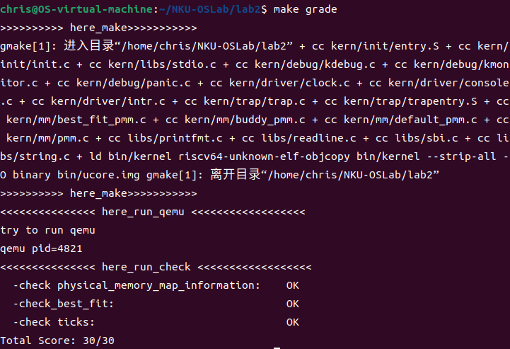

# 物理内存和页表
## 一、实验目的

- 理解页表的建立和使用方法
- 理解物理内存的管理方法
- 理解页面分配算法

​实验一过后我们做出来了一个可以启动的系统，实验二主要涉及操作系统的物理内存管理。操作系统为了使

用内存，还需高效地管理内存资源。本次实验我们会了解如何发现系统中的物理内存，然后学习如何建立对

物理内存的初步管理，即了解连续物理内存管理，最后掌握页表相关的操作，即如何建立页表来实现虚拟内

存到物理内存之间的映射，帮助我们对段页式内存管理机制有一个比较全面的了解。本次的实验主要是在实

验一的基础上完成物理内存管理，并建立一个最简单的页表映射

## 二、实验过程

### 练习1：**理解首次适应（First-Fit）连续物理内存分配算法**

在深入分析了 `kern/mm/default_pmm.c` 文件中的相关代码后，我们对 `default_init`、`default_init_memmap`、`default_alloc_pages` 和 `default_free_pages` 等函数的功能进行了简要讨论，并阐述了这些函数在物理内存分配过程中的具体作用。

#### `default_init` 函数：
`free_list` 是一个 `list_entry` 结构的双向链表指针，用于管理空闲内存块。`nr_free` 变量则用于记录当前可用的空闲页数。该函数的主要任务是初始化这个链表，并将可用内存页数设置为0，表示系统开始时没有任何空闲页块可供使用。

#### `default_init_memmap` 函数：
`default_init_memmap` 函数负责根据 `page_init` 函数传递的参数（包括空闲内存块的起始页和页数），将这些空闲块构建为一个双向链表。链表的头指针为 `free_area->free_list`，链表项为 `Page` 数据结构中的 `base->page_link` 成员。假定这些空闲块是按地址从低到高的顺序传递的，因此通过这个链表结构可以管理整个连续的空闲内存区域。

#### `default_alloc_pages` 函数：
此函数负责从空闲链表中分配页块。First-Fit 算法要求从链表头开始，逐块检查空闲内存区域。通过 `list_next` 函数遍历链表，并使用 `le2page` 宏获取每个链表节点对应的 `Page` 结构体指针 `p`。如果 `p->property` 的值大于或等于请求的页数 `n`，则表示该块可以满足请求，函数将调整链表并返回这个分配的页块。

#### `default_free_pages` 函数：
`default_free_pages` 函数实现了内存块的释放和合并。当内存块被释放时，需要将其与相邻的空闲块进行合并，以减少内存碎片。这个函数根据释放块与周围空闲块的位置关系，处理三种情况：释放块紧邻下一个空闲块、释放块紧邻前一个空闲块、以及释放块周围没有其他空闲块。合并完成后，将新的空闲块重新加入空闲链表。


#### QA: 你的 first fit 算法是否有进一步的改进空间？

首次适应算法（First Fit）虽然是一种相对简单且常见的内存分配方法，但在性能和效率方面仍有改进的空间。以下是一些可能的优化思路：

1. **优化搜索过程**：
   - 在处理大型系统时，遍历空闲内存链表可能会造成显著的性能问题。为此，可以考虑使用**平衡二叉树**或其他更高效的数据结构来加速搜索。不过，**构建平衡树的代价也需要纳入考虑**，因此需要权衡利弊。

2. **延迟内存块合并**：
   - 当释放内存时，可以选择不立即进行内存块合并，而是通过定期触发合并操作来减少频繁合并带来的开销，进而提升在高负载情况下的性能表现。

3. **分层管理内存**：
   - 可以将内存按不同大小进行分层，每一层包含特定大小的块。类似**多级链表**的结构可以帮助快速找到适合的内存块，降低搜索所需的时间。

4. **提前分配和释放**：
   - 根据系统的历史使用数据和当前负载模式，提前预测未来的内存需求和释放情况，并提前执行这些操作，从而提高内存分配的效率。

5. **应用缓存机制**：
   - 对于频繁分配和释放的小内存块，可以引入**缓存**机制，以加快这些操作的速度，减少不必要的内存分配和释放过程。


### 练习2：**最佳适应（Best-Fit）连续物理内存分配算法**

Best-Fit 算法通过遍历整个空闲链表，选择满足要求的最小空闲块，从而尽量减少内存碎片。相比于 First-Fit 算法，它更关注内存利用率，但由于需要遍历整个链表，时间复杂度较高。以下是具体的实现及其分析：

#### `struct Page` 结构体说明：
`struct Page` 是操作系统用于描述物理页的关键数据结构。它包含页的引用计数、标志信息、页块的大小以及双向链表指针。具体定义如下：

```c
struct Page {
    int ref;                       // 页的引用计数
    uint64_t flags;                // 页的标志，用于表示该页的状态
    unsigned int property;         // 表示空闲页块的大小
    list_entry_t page_link;        // 双向链表指针，链接空闲页块
};
```

#### `best_fit_init_memmap` 函数：
该函数负责初始化连续空闲页块，并将其插入空闲链表中。链表中的页块按照地址顺序排列，系统会根据页块的大小和地址位置，将其插入到合适的位置。首先清空页的属性并初始化页块，然后通过比较页块的地址，找到合适的位置进行插入。具体代码如下：
```c
static void
best_fit_init_memmap(struct Page *base, size_t n) {
    assert(n > 0);
    struct Page *p = base;
    for (; p != base + n; p ++) {
        assert(PageReserved(p));

        /*LAB2 EXERCISE 2: 2213748*/ 
        // 清空当前页框的标志和属性信息，并将页框的引用计数设置为0
        p->flags = p->property = 0;
        set_page_ref(p, 0);
    }
    base->property = n;
    SetPageProperty(base);
    nr_free += n;
    if (list_empty(&free_list)) {
        list_add(&free_list, &(base->page_link));
    } else {
        list_entry_t* le = &free_list;
        while ((le = list_next(le)) != &free_list) {
            struct Page* page = le2page(le, page_link);
             /*LAB2 EXERCISE 2: 2213748*/ 
            // 编写代码
            // 1、当base < page时，找到第一个大于base的页，将base插入到它前面，并退出循环
            // 2、当list_next(le) == &free_list时，若已经到达链表结尾，将base插入到链表尾部
            if (base < page){
                list_add_before(le, &(base->page_link));
                break;
            }
            else if (list_next(le) == &free_list){
                list_add_after(le, &(base->page_link));
            }
        }
    }
}
```

#### `best_fit_alloc_pages` 函数：
该函数负责在空闲链表中查找最小的满足条件的页块。相比于 First-Fit，Best-Fit 算法会遍历整个链表，选择最适合的空闲块。具体实现中，通过比较 property 值，找到大小最接近需求的块，并将其分配出去。
```c
static struct Page *
best_fit_alloc_pages(size_t n) {
    assert(n > 0);
    if (n > nr_free) {
        return NULL;
    }
    struct Page *page = NULL;
    list_entry_t *le = &free_list;
    size_t min_size = nr_free + 1;
     /*LAB2 EXERCISE 2: 2213748*/ 
    // 下面的代码是first-fit的部分代码，请修改下面的代码改为best-fit
    // 遍历空闲链表，查找满足需求的空闲页框
    // 如果找到满足需求的页面，记录该页面以及当前找到的最小连续空闲页框数量
    while ((le = list_next(le)) != &free_list) {
        struct Page *p = le2page(le, page_link);
        if (p->property >= n && p->property < min_size) {
            min_size = p->property;
            page = p;
        }
    }

    if (page != NULL) {
        list_entry_t* prev = list_prev(&(page->page_link));
        list_del(&(page->page_link));
        if (page->property > n) {
            struct Page *p = page + n;
            p->property = page->property - n;
            SetPageProperty(p);
            list_add(prev, &(p->page_link));
        }
        nr_free -= n;
        ClearPageProperty(page);
    }
    return page;
}
```
#### `best_fit_free_pages` 函数：
该函数用于释放页块并将其重新插入空闲链表中。在合并空闲页块时，Best-Fit 算法会通过地址比较，确保新释放的页块能够合并到合适的位置，以最大化减少内存碎片。
```c
static void
best_fit_free_pages(struct Page *base, size_t n) {
    assert(n > 0);
    struct Page *p = base;
    for (; p != base + n; p ++) {
        assert(!PageReserved(p) && !PageProperty(p));
        p->flags = 0;
        set_page_ref(p, 0);
    }
    /*LAB2 EXERCISE 2: 2213748*/ 
    // 编写代码
    // 具体来说就是设置当前页块的属性为释放的页块数、并将当前页块标记为已分配状态、最后增加nr_free的值
    base->property = n;
    SetPageProperty(base);
    nr_free += n;

    if (list_empty(&free_list)) {
        list_add(&free_list, &(base->page_link));
    } else {
        list_entry_t* le = &free_list;
        while ((le = list_next(le)) != &free_list) {
            struct Page* page = le2page(le, page_link);
            if (base < page) {
                list_add_before(le, &(base->page_link));
                break;
            } else if (list_next(le) == &free_list) {
                list_add(le, &(base->page_link));
            }
        }
    }

    list_entry_t* le = list_prev(&(base->page_link));
    if (le != &free_list) {
        p = le2page(le, page_link);
        /*LAB2 EXERCISE 2: 2213748*/ 
         // 编写代码
        // 1、判断前面的空闲页块是否与当前页块是连续的，如果是连续的，则将当前页块合并到前面的空闲页块中
        // 2、首先更新前一个空闲页块的大小，加上当前页块的大小
        // 3、清除当前页块的属性标记，表示不再是空闲页块
        // 4、从链表中删除当前页块
        // 5、将指针指向前一个空闲页块，以便继续检查合并后的连续空闲页块
        if (p + p->property == base){
            p->property += base->property;
            ClearPageProperty(base);
            list_del(&(base->page_link));
            base = p;
        }
    }

    le = list_next(&(base->page_link));
    if (le != &free_list) {
        p = le2page(le, page_link);
        if (base + base->property == p) {
            base->property += p->property;
            ClearPageProperty(p);
            list_del(&(p->page_link));
        }
    }
}
```
#### 测试结果：


#### QA: 你的 Best-Fit 算法是否有进一步的改进空间？

类似于 First Fit，Best-Fit 算法的优化方向可以包括：搜索过程的提升、延迟合并策略、分层管理内存、预分配和预释放、以及引入缓存机制等。这些方法都可以有效提升算法的效率和内存管理性能。

此外，由于 Best-Fit 需要遍历整个空闲链表，当链表长度过长时会导致时间开销较大。因此，可以考虑结合 First-Fit 的方法，只遍历到合适的页块后立即停止，以加快分配速度。
