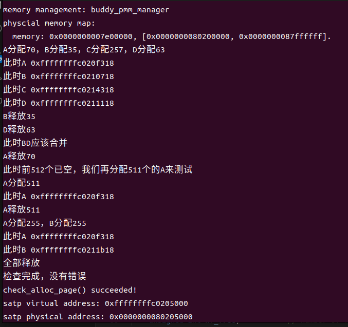

# buddy system（伙伴系统）分配算法

## buddy分配算法实现功能
将内存按2的幂进行划分，从而减少内存碎片，其初始化时需要分配的内存大小为2的n次幂。

在内存分配过程中，首先需要寻找大于等于所需大小并且最接近2的幂的大小的内存块，然后如果能找到大小刚好一致的就直接分配，否则就对大块进行对半分割，分割后重复进行以上操作，直到获得大小合适的块。

在内存释放过程中，在释放内存块后，会寻找相邻的块，看其是否释放了，如果相邻块也释放了，合并这两个块，重复上述步骤直到遇上未释放的相邻块。

## 实现思路

全局变量 `freelist`（`list_entry_t free_list`）： 是一个双向链表，用于维护所有空闲的内存块。在初始化时，`freelist` 中的每个节点都代表一个空闲的内存块。链表的节点存储了指向物理页的指针（`struct Page*`），链表中的property项表示当前可用的空闲页数。这个链表用于在分配内存时查找可用的空闲块，以及在释放内存时将空闲块添加回链表中。

buddy_init_memmap和default_init_memmap一致，唯一需要注意的是需要将需要分配的内存大小转化为不超过它的最接近2的幂的大小。

buddy_alloc_pages函数接收1个参数n,表示所需要分配的内存页数,实现如下:
```c
assert(n > 0);
size_t u=fixsize(n);
if (u > nr_free) {
    return NULL;
}
```

首先对于输入的n进行判断其是否合法,然后将其转化为大于等于n并且最接近的2的幂。
```c
struct Page *page = NULL;
list_entry_t *le = &free_list;
size_t min_size=1e9;
while ((le = list_next(le)) != &free_list) {
    struct Page *p = le2page(le, page_link);
    if (p->property >= u&&min_size>p->property) {
        page = p;
        min_size=page->property;
    }
}
```
然后寻找大于n大小的且最小的数据块
```c
if (page != NULL) 
{
    while(page->property>=2*u)
    {
        list_entry_t* prev = list_prev(&(page->page_link));
        list_entry_t* next = list_next(&(page->page_link));
        list_del(&(page->page_link));
        struct Page *p = page + page->property/2;
        struct Page *q = page;
        p->property=page->property/2;
        q->property=page->property/2;
        SetPageProperty(p);
        SetPageProperty(q);
        list_add(prev, &(q->page_link));
        list_add_before(next, &(p->page_link));
        page=q;
    }
    list_del(&(page->page_link));
    nr_free -= page->property;
    ClearPageProperty(page);
}
return page;
```
最后,如果存在这样的页,就考虑它的大小是否刚刚好,如果大于所需大小,就对其进行分割,并将分割后的块放回链表中,直到出现大小合适的块,此时将其从链表中删去,同时减少内存可用空间并将page返回.

buddy_free_pages函数接收两个参数,base为需要回收的内存块,n为其大小,实现方式如下:
```c
assert(n > 0);
n=fixsize(n);
struct Page *p = base;
for (; p != base + n; p ++) {
    assert(!PageReserved(p) && !PageProperty(p));
    p->flags = 0;
    set_page_ref(p, 0);
}
base->property = n;
SetPageProperty(base);
nr_free += n;
if (list_empty(&free_list)) {
    list_add(&free_list, &(base->page_link));
} 
else {
    list_entry_t* le = &free_list;
    while ((le = list_next(le)) != &free_list) {
        struct Page* page = le2page(le, page_link);
        if (base < page) {
            list_add_before(le, &(base->page_link));
            break;
        } 
        else if (list_next(le) == &free_list) {
            list_add(le, &(base->page_link));
        }
    }
}
```
先对输入的n进行判断,将其修正为大于n且最小的2的幂,释放从base开始的大小为n的数据块,并将其添加回链表中的合适位置.
```c
size_t flag=1;
struct Page *q=le2page(list_next(&free_list),page_link);
while(flag==1)
{
    if(((base-q)/base->property)%2==1)
    {
        list_entry_t* le = list_prev(&(base->page_link));
        if (le != &free_list) {
            p = le2page(le, page_link);
            if (p + p->property == base && p->property==base->property) {
                p->property += base->property;
                ClearPageProperty(base);
                list_del(&(base->page_link));
                base = p;
            }
            else flag=0;
        }
        else flag=0;
    }
    else if(((base-q)/base->property)%2==0)
    {
        list_entry_t* le = list_next(&(base->page_link));
        if (le != &free_list) {
            p = le2page(le, page_link);
            if (base + base->property == p && p->property==base->property) {
                base->property += p->property;
                ClearPageProperty(p);
                list_del(&(p->page_link));
            }
            else flag=0;
        }
        else flag=0;
    }
}
```
考虑它应该如何与相邻项进行合并,链表中第2n项应该与2n+1项合并,而不应该考虑与2n-1项合并,否则可能导致第2和第3项合并后第1项找不到可合并的块的问题.合并操作主要包括延长靠前块的可用长度并从链表中删去靠后项.

## 测试结果
使用的测试函数如下
```c
struct Page *p0, *A, *B, *C, *D;
p0 = A = B = C = D = NULL;
A = alloc_pages(70);
B = alloc_pages(35);
C = alloc_pages(257);
D = alloc_pages(63);
free_pages(B, 35);
free_pages(D, 63);
free_pages(A, 70);
A = alloc_pages(511);
free_pages(A, 511);
A = alloc_pages(255);
B = alloc_pages(255);
free_pages(C, 257);
free_pages(A, 255);
free_pages(B, 255);  
```

测试的流程如图所示(因为只涉及前1024页,所以仅展示前1024页的空间结构,其中红色代表被使用的区块,数字代表区块大小)


测试结果如下图所示:



可以验证算法正确.
