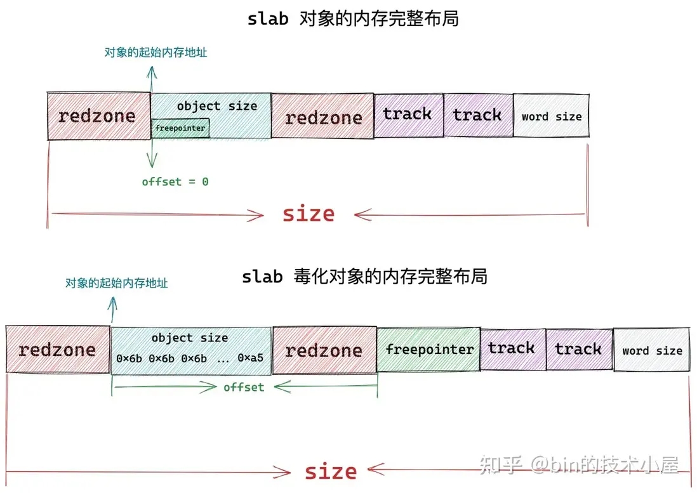

# slub算法

## 前言(小吐槽)

实验指导手册里面直接给出了一个去往代码仓库的链接，代码足足有7446行，根本看不完也看不明白！
为此，我去网上找了一些博客资料（类似于伙伴系统里面的那种），我认为讲的比较清楚，展示在下面:

### 究极详细的博客: `https://segmentfault.com/a/1190000043626203#item-9 `（这篇博客的上一篇就是将伙伴系统的，讲的也很详细，强力推荐给学弟学妹们这篇文章作参考）

### 这篇博客里面也有详细图解: `https://www.cnblogs.com/LoyenWang/p/11922887.html`

### 这篇B站图文讲解也可以，但是不如其他详细: `https://www.bilibili.com/read/cv35002973/`

## 整体设计思想

在完整学过slub算法的原理之后，我发觉就这个小小的ucore内核实现slub算法是不现实的，因此需要提取思想将其简化。先附上一张slub总体结构图:（图中的slab看成slub就行）


可以看到图中重要的数据结构有kmem_cache(链表)、percpu、slub_page和NUMA_node。这些实现太复杂了，肯定不可能都实现，因此需要简化。

在实验指导书中将slub算法的原理概括成了两层:

 `第一层是基于页大小的内存分配，第二层是在第一层基础上实现基于任意大小的内存分配。` 
 
 毕竟是实验指导书，不可能花费大量的篇幅去描述slub算法的思想。因此我参照“究极详细的博客”中对slub原理的概括: 

`slab 首先会向伙伴系统一次性申请一个或者多个物理内存页面，正是这些物理内存页组成了 slab 内存池。`

`随后 slab 内存池会将这些连续的物理内存页面划分成多个大小相同的小内存块出来，同一种 slab 内存池下，划分出来的小内存块尺寸是一样的。内核会针对不同尺寸的小内存分配需求，预先创建出多个 slab 内存池出来。`


`既然 slab 专门是用于小内存块分配与回收的，那么内核很自然的就会想到，分别为每一个需要被内核频繁创建和释放的核心对象创建一个专属的 slab 对象池，这些内核对象专属的 slab 对象池会根据其所管理的具体内核对象所占用内存的大小 size，将一个或者多个完整的物理内存页按照这个 size 划分出多个大小相同的小内存块出来，每个小内存块用于存储预先创建好的内核对象。`

把任务目标简化如下：

### (1)设计object和slub页的结构，并设计接口从伙伴系统中存取Page。当slub池中empty的页面过多时，就把slub页（转换成正常页）放回伙伴系统；如果slub池中页面不够，则利用伙伴系统取出几个空闲页作为slub页。

### (2)将slub页切实划分成多个object。（注意同一个slub页中的object大小是固定的）

### (3)管理slub页的状态（分为三种，empty、full和partial，表示空闲、满和部分占用三种状态）

### (4)实现分配和实现(快慢路径)

但是就算把目标简化成上述四条，对于这个小小的ucore还是过于复杂了，因此我在数据结构上也进行了简化:将与cpu相关的部分删去，只保留free_list、partial_list等必要的数据结构。详细设计将在下文中说明。

## object设计

在传统slub算法中，object有两种形式:普通object和POISON object（毒化）。如下图所示:



可以看到里面有不同的部分。最重要的部分是object_size、freepointer和redzone(起padding作用，实际上还有防止溢出的作用)。

要简化object结构，可以保留object_size和freepointer即可，必要时可以增加padding填充。

## slub页设计

slub页需要实现几个功能:保存页状态（empty、full或者是partial）、页大小（定值，可以不用写进结构体中）、object大小或者是object个数（object_size * object_num = page_size = 4K）

```c
struct SlubPage {
    struct slub_cache *p_slub_cache;// 指向对应的slub_cache
    size_t object_size;             // 表示object的大小
    size_t free_object_num;         // 保存剩余objects的数量
    unsigned int page_status;       // 0为empty、1为partial、2为full
    uint64_t first_free_object;     // 指向第一个空闲object
    // 下面的是原先的页实现的部分
    int ref;                        // page frame's reference counter
    uint64_t flags;                 // array of flags that describe the status of the page frame
    unsigned int property;          // the num of free block, used in first fit pm manager
    list_entry_t page_link;         // free list link
};
```

## slub_cache设计


