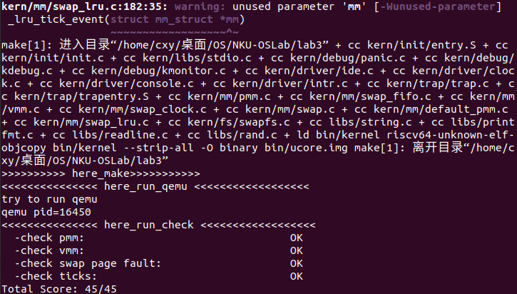

# 扩展练习 Challenge：实现不考虑实现开销和效率的LRU页替换算法

## LRU页面置换算法介绍

LRU(Least Recently Used)算法，即最久未使用算法。基于局部性原理，当发生缺页异常时，系统会选择最近最远未访问过的进行替换。

## LRU页面置换算法设计与实现

LRU一般的做法是，记录每个页面最后访问的时间，每次发生缺页异常时，需要找到所有页面中时间最早的页面进行替换。

可是基于给定的FIFO算法实例（用一个双向链表实现的队列），我们可以很自然地想到一个更简单的实现方式（不要求时间复杂度）：每当页面被访问时，我们都去遍历一遍这个链表，如果这个页面在链表中，那么就把它重新排到队尾，这样每次发生缺页异常时，从队首取出的自然就是最久未访问过的页面。

由于不考虑时间复杂度，为了方便考虑，在将链表内元素从队中移动到队尾时，直接调用了list_del和list_add函数，采用先删除后添加的方式替代了移动的过程。我把LRU算法操作的过程实现为了_lru_operate函数：

```c
static int 
_lru_operate(struct mm_struct *mm, uintptr_t addr){
    // 该函数的作用是，如果访问的页在链表中，那么就将其挪到队尾
    bool judge = false; //判断页是否在链表中
    list_entry_t *head=(list_entry_t*) mm->sm_priv;

    // 寻找物理地址对应的页
    addr = ROUNDDOWN(addr, PGSIZE);
    pte_t *ptep = get_pte(mm->pgdir, addr, 1);
    struct Page *page = pte2page(*ptep);

    list_entry_t *entry=&(page->pra_page_link);

    //遍历链表，如果entry在链表中，那么就将其挪到队尾
    curr_ptr = list_next(head);
    while(curr_ptr != head){// 遍历链表
        if(le2page(curr_ptr, pra_page_link) == page){//如果这个page在链表中，采用先删除后添加的方式
            judge = true;
            list_del(curr_ptr);
            break;
        }
        curr_ptr = list_next(curr_ptr);
    }
    if(judge){
        list_add(head, entry);
    }
    return 0;
}
```

函数的输入是相应的mm_struct指针和访问的物理地址，函数做了两件事：找到物理地址对应的页，检查页是否在链表中。其中需要注意的是，在寻找物理地址对应的页的过程中，首先要将物理地址按照PGSIZE向下取整对齐，然后利用get_pte函数拿到该物理地址对应的页表项的地址，最后再利用pte2page函数找到其对应的页。

可是又出现了一个大问题：我们无法找到页是何时何地在内核中被访问的。如果把这段函数放入_lru_map_swappable函数中，会出现问题：该函数只有当发生缺页异常时才会被调用，页命中时不会进入该函数。所以我们无奈地手动修改check函数（只修改了LRU算法的check函数，fifo和clock算法的check函数没有进行任何修改），在每次访问页后手动调用_lru_operate函数，模拟LRU算法的过程。修改后的check函数和测试样例如下一节所示。


## 测试样例与测试结果

我编写的LRU算法的测试样例沿用了fifo算法的测试样例：

__初始化：abcd (调用顺序从左到右，下同)__

__check函数：cadbebabcdea__

__队列长度：4，总页面个数：5 (a、b、c、d、e)__

与fifo算法不同的是，为在每个页面访问后调用了_lru_operate函数模拟LRU算法过程，因此缺页情况与fifo算法有所不同，缺页数量也比fifo算法少很多。我将LRU算法的理论结果以注释形式标注在了函数中，注释的内容为进行完成当次页操作后，队列中的情况和是否引发缺页异常，函数如下所示：（初始化函数没有发生任何改变，不进行展示）

```c
static int
_lru_check_swap(struct mm_struct *mm) {
    // 队列中已经存在的元素：abcd（队首->队尾）
    cprintf("write Virt Page c in lru_check_swap\n");
    *(unsigned char *)0x3000 = 0x0c;
    _lru_operate(mm, 0x3000); // Queue:abdc, hit
    assert(pgfault_num==4);
    cprintf("write Virt Page a in lru_check_swap\n");
    *(unsigned char *)0x1000 = 0x0a;
    _lru_operate(mm, 0x1000); // Queue:bdca, hit
    assert(pgfault_num==4);
    cprintf("write Virt Page d in lru_check_swap\n");
    *(unsigned char *)0x4000 = 0x0d;
    _lru_operate(mm, 0x4000); // Queue:bcad, hit
    assert(pgfault_num==4);
    cprintf("write Virt Page b in lru_check_swap\n");
    *(unsigned char *)0x2000 = 0x0b;
    _lru_operate(mm, 0x2000); // Queue:cadb, hit
    assert(pgfault_num==4);
    cprintf("write Virt Page e in lru_check_swap\n");
    *(unsigned char *)0x5000 = 0x0e;
    _lru_operate(mm, 0x5000); // Queue:adbe, miss
    assert(pgfault_num==5);
    cprintf("write Virt Page b in lru_check_swap\n");
    *(unsigned char *)0x2000 = 0x0b;
    _lru_operate(mm, 0x2000); // Queue:adeb, hit
    assert(pgfault_num==5);
    cprintf("write Virt Page a in lru_check_swap\n");
    *(unsigned char *)0x1000 = 0x0a;
    _lru_operate(mm, 0x1000); // Queue:deba, hit
    assert(pgfault_num==5);
    cprintf("write Virt Page b in lru_check_swap\n");
    *(unsigned char *)0x2000 = 0x0b;
    _lru_operate(mm, 0x2000); // Queue:deab, hit
    assert(pgfault_num==5);
    cprintf("write Virt Page c in lru_check_swap\n");
    *(unsigned char *)0x3000 = 0x0c;
    _lru_operate(mm, 0x3000); // Queue:eabc, miss
    assert(pgfault_num==6);
    cprintf("write Virt Page d in lru_check_swap\n");
    *(unsigned char *)0x4000 = 0x0d;
    _lru_operate(mm, 0x4000); // Queue:abcd, miss
    assert(pgfault_num==7);
    cprintf("write Virt Page e in lru_check_swap\n");
    *(unsigned char *)0x5000 = 0x0e;
    _lru_operate(mm, 0x5000); // Queue:bcde, miss
    assert(pgfault_num==8);
    cprintf("write Virt Page a in lru_check_swap\n");
    assert(*(unsigned char *)0x1000 == 0x0a);
    *(unsigned char *)0x1000 = 0x0a;
    _lru_operate(mm, 0x5000); // Queue:cdea, miss
    assert(pgfault_num==9);
    return 0;
}
```

函数中的assert断言判读缺页数量是否正确，每一次miss后pgfault_num加一。

对上述LRU算法进行测试，得到的结果如下图所示：



check_swap阶段的日志(位于.qemu.out)如下所示：(//后为后加的注释，原始文件中没有)
```
BEGIN check_swap: count 2, total 31661
setup Page Table for vaddr 0X1000, so alloc a page
setup Page Table vaddr 0~4MB OVER!
set up init env for check_swap begin! // 初始化阶段，顺序访问页abcd
Store/AMO page fault                  // 初始化访问a,miss,队列：a（队首->队尾）
page fault at 0x00001000: K/W
curr_ptr 0xffffffffc02258a8
Store/AMO page fault                  // 初始化访问b,miss,队列：ab
page fault at 0x00002000: K/W
curr_ptr 0xffffffffc02258f0
Store/AMO page fault                  // 初始化访问c,miss,队列：abc
page fault at 0x00003000: K/W
curr_ptr 0xffffffffc0225938
Store/AMO page fault                  // 初始化访问d,miss,队列：abcd
page fault at 0x00004000: K/W
curr_ptr 0xffffffffc0225980
set up init env for check_swap over!  // 初始化完毕，下面开始测试
write Virt Page c in lru_check_swap   // 访问c,hit ,队列：abdc
write Virt Page a in lru_check_swap   // 访问a,hit ,队列：bdca
write Virt Page d in lru_check_swap   // 访问d,hit ,队列：bcad
write Virt Page b in lru_check_swap   // 访问b,hit ,队列：cadb
write Virt Page e in lru_check_swap   // 访问e,miss,队列：adbe
Store/AMO page fault
page fault at 0x00005000: K/W
swap_out: i 0, store page in vaddr 0x3000 to disk swap entry 4
curr_ptr 0xffffffffc0225938
write Virt Page b in lru_check_swap   // 访问b,hit ,队列：adeb
write Virt Page a in lru_check_swap   // 访问a,hit ,队列：deba
write Virt Page b in lru_check_swap   // 访问b,hit ,队列：deab
write Virt Page c in lru_check_swap   // 访问c,miss,队列：eabc
Store/AMO page fault
page fault at 0x00003000: K/W
swap_out: i 0, store page in vaddr 0x4000 to disk swap entry 5
swap_in: load disk swap entry 4 with swap_page in vadr 0x3000
curr_ptr 0xffffffffc0225980
write Virt Page d in lru_check_swap   // 访问d,miss,队列：abcd
Store/AMO page fault
page fault at 0x00004000: K/W
swap_out: i 0, store page in vaddr 0x5000 to disk swap entry 6
swap_in: load disk swap entry 5 with swap_page in vadr 0x4000
curr_ptr 0xffffffffc0225938
write Virt Page e in lru_check_swap   // 访问e,miss,队列：bcde
Store/AMO page fault
page fault at 0x00005000: K/W
swap_out: i 0, store page in vaddr 0x1000 to disk swap entry 2
swap_in: load disk swap entry 6 with swap_page in vadr 0x5000
curr_ptr 0xffffffffc02258a8
write Virt Page a in lru_check_swap   // 访问a,miss,队列：cdea
Load page fault
page fault at 0x00001000: K/R
swap_out: i 0, store page in vaddr 0x2000 to disk swap entry 3
swap_in: load disk swap entry 2 with swap_page in vadr 0x1000
curr_ptr 0xffffffffc02258f0
count is 1, total is 8
check_swap() succeeded!
```
