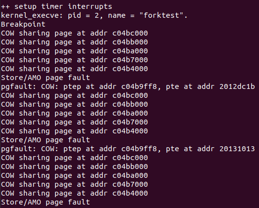

# Lab5:用户程序
## 一、实验目的

 * 了解第一个用户进程创建过程
 * 了解系统调用框架的实现机制
 * 了解ucore如何实现系统调用sys_fork/sys_exec/sys_exit/sys_wait来进行进程管理

## 二、实验过程

### 练习1: 加载应用程序并执行（需要编码）

`do_execv` 函数调用 `load_icode`（位于 kern/process/proc.c 中）来加载并解析一个处于内存中的 ELF 执行文件格式的应用程序。你需要补充 `load_icode` 的第6步，建立相应的用户内存空间来放置应用程序的代码段、数据段等，且要设置好 `proc_struct` 结构中的成员变量 trapframe 中的内容，确保在执行此进程后，能够从应用程序设定的起始执行地址开始执行。需设置正确的 trapframe 内容。

请在实验报告中简要说明你的设计实现过程。

首先分析我们需要实现的函数load_icode，它实际运行逻辑如下：

1. 首先检查当前进程的内存管理结构是否为空，如果不为空，则报错，如果为空，则为当前进程创建一个新的内存管理结构。
1. 如果建立成功，就给它分配一个内存管理页表。
1. 根据elf的e_magic，先判断其是否是一个合法的ELF文件。然后遍历每一个程序段头，对每个类型为ELF_PT_LOAD的section进行处理。
1. 建立用户栈空间，同时为用户栈分配了一块合法的虚拟内存空间。
1. 设置当前进程的内存管理器，页表寄存器以及当前用户进程的trapframe结构体。

通过分析可知，我们需要完善的最后一步就是设置trapframe这个结构体，一共需要设置三个寄存器的值：

1. 将tf->gpr.sp设置为用户栈的顶部地址。
2. epc指向ELF可执行文件加载到内存之后的入口处
3. 设置tf->status，将特权级别设置为用户模式，并且禁用中断。


- **请简要描述这个用户态进程被 ucore 选择占用 CPU 执行（RUNNING 态）到具体执行应用程序第一条指令的整个经过。**

- 进程被创建后，它处于就绪态，等待操作系统内核调度选中它来执行。在就绪态下，进程被加入到可运行的进程队列中。
- do_wait函数确认存在可以RUNNABLE的子进程后，调用schedule函数。
- schedule函数通过调用proc_run来运行新线程（上次的练习3）。在proc_run里面它会切换当前进程为要运行的进程，切换页表，以便使用新进程的地址空间。然后调用switch_to()函数实现上下文切换。
- 切换完进程上下文，然后跳转到forkret。forkret函数是直接调用forkrets函数，forkrets再把传进来的参数，也就是进程的中断帧放在了sp，然后跳到__trapret。
- __trapret函数直接从中断帧里面恢复所有的寄存器，然后通过sret指令，跳转到userproc->tf.epc指向的函数，即kernel_thread_entry。
- 由于`int pid = kernel_thread(user_main, NULL, 0)`这里把user_main作为参数传给了tf.gpr.s0（上一次实验说到s0寄存器里放的是新进程要执行的函数），所以kernel_thread_entry里我们跳转到user_main。
- user_main打印userproc的pid和name信息，然后调用kernel_execve。
- kernel_execve这里没有直接调用do_execve函数，而是用ebreak产生断点中断进行处理，进入exception_handler函数的断点处理，通过设置a7寄存器的值为10说明这不是一个普通的断点中断，而是要转发到syscall()。而SYS_exec作为系统调用号，告诉syscall()要执行do_execve函数。
- do_execve检查虚拟内存空间的合法性，释放虚拟内存空间，加载应用程序，创建新的mm结构和页目录表。其中最重要的是do_execve调用load_icode函数，load_icode加载应用程序的各个program section到新申请的内存上，为BSS section分配内存并初始化为全0，分配用户栈内存空间。设置当前用户进程的mm结构、页目录表的地址及加载页目录表地址到cr3寄存器。设置当前用户进程的tf结构。
- 执行完load_icode函数后，就会把user_main传递进来的参数设置当前用户进程的名字后返回。这里一直返回到exception_handler函数，接着执行`kernel_execve_ret(tf,current->kstack+KSTACKSIZE)`函数。
- kernel_execve_ret函数主要操作是调整栈指针并复制上一个陷阱帧的内容到新的陷阱帧中。然后跳转到_trapret函数。
- 通过__trapret函数RESTORE_ALL，然后sret跳转到epc指向的函数（tf->epc = elf->e_entry），即用户程序的入口。
- 最后执行应用程序第一条指令。


---


### 练习2: 父进程复制自己的内存空间给子进程（需要编码）
#### 2.1 完成 `copy_range` 函数
创建子进程的函数 `do_fork` 在执行中将当前进程（即父进程）的用户内存地址空间中的合法内容复制给新进程（子进程），完成内存资源的复制。具体是通过 `copy_range` 函数（位于kern/mm/pmm.c中）实现的，请补充 `copy_range` 的实现，确保能够正确执行。

请在实验报告中简要说明你的设计实现过程。

`copy_range` 函数是进程创建过程中的一个关键组成部分，它负责在父进程和子进程之间复制用户内存地址空间的内容。当操作系统通过 `do_fork` 函数创建一个新进程时，会根据 clone_flags 标志位来决定是否需要为子进程复制父进程的内存内容。如果需要复制，`do_fork` 会调用 `copy_mm` 函数，该函数进一步调用 `dup_mmap`，最终由 `dup_mmap` 调用 `copy_range` 来执行实际的内存复制工作。`copy_range` 的调用流图为：`do_fork` --> `copy_mm` --> `dup_mmap` --> `copy_range`

`copy_range` 函数的参数包括指向子进程页目录的 `to` 指针，指向父进程页目录的 `from` 指针，以及一个 `share` 标志位，后者在当前实现中并未使用，因为在练习2中，我们采用的是复制（dup）而非共享（share）内存的方法。在 Challenge 中实现 COW 机制时会用到这个参数。`copy_range` 函数的作用是遍历父进程中由 `start` 和 `end` 界定的虚拟地址范围，为子进程中的每个页面分配新的物理页面，并将父进程页面的内容复制到这些新分配的页面中。在这个过程中，`copy_range` 还会保留页面的权限设置，确保子进程能够以正确的权限访问其内存页面。 `copy_range` 函数实现如下：

```c
int copy_range(pde_t *to, pde_t *from, uintptr_t start, uintptr_t end,
               bool share) {
    assert(start % PGSIZE == 0 && end % PGSIZE == 0);
    assert(USER_ACCESS(start, end));
    // copy content by page unit.
    do {
        // call get_pte to find process A's pte according to the addr start
        pte_t *ptep = get_pte(from, start, 0), *nptep;
        if (ptep == NULL) {
            start = ROUNDDOWN(start + PTSIZE, PTSIZE);
            continue;
        }
        // call get_pte to find process B's pte according to the addr start. If
        // pte is NULL, just alloc a PT
        if (*ptep & PTE_V) {
            if ((nptep = get_pte(to, start, 1)) == NULL) {
                return -E_NO_MEM;
            }
            uint32_t perm = (*ptep & PTE_USER);
            // get page from ptep
            struct Page *page = pte2page(*ptep);
            // alloc a page for process B
            struct Page *npage = alloc_page();
            assert(page != NULL);
            assert(npage != NULL);
            int ret = 0;
            /* LAB5:EXERCISE2 YOUR CODE
             * replicate content of page to npage, build the map of phy addr of
             * nage with the linear addr start
             *
             * Some Useful MACROs and DEFINEs, you can use them in below
             * implementation.
             * MACROs or Functions:
             *    page2kva(struct Page *page): return the kernel vritual addr of
             * memory which page managed (SEE pmm.h)
             *    page_insert: build the map of phy addr of an Page with the
             * linear addr la
             *    memcpy: typical memory copy function
             *
             * (1) find src_kvaddr: the kernel virtual address of page
             * (2) find dst_kvaddr: the kernel virtual address of npage
             * (3) memory copy from src_kvaddr to dst_kvaddr, size is PGSIZE
             * (4) build the map of phy addr of  nage with the linear addr start
             */
            void* src_kvaddr = page2kva(page); // 获取父进程页面的内核虚拟地址作为memcpy函数的源地址
            void* dst_kvaddr = page2kva(npage); // 获取子进程页面的内核虚拟地址作为memcpy函数的目的地址
            memcpy(dst_kvaddr, src_kvaddr, PGSIZE); // 复制附近成的页面内容到子进程的页面中
            ret = page_insert(to, npage, start, perm); // 建立子进程页面虚拟地址到物理地址的映射关系 
            assert(ret == 0);
        }
        start += PGSIZE;
    } while (start != 0 && start < end);
    return 0;
}
```

总的来说，`copy_range` 函数的功能就是以页为单位调用 `memcpy` 函数，将父进程的用户内存地址空间中的内容逐页复制到子进程中，从而完成内存资源的复制。

#### 2.2 设计并实现COW机制（包括Challenge的要求）
- **如何设计实现 Copy on Write 机制？** 给出概要设计，鼓励给出详细设计。

> **Copy-on-write (简称COW)** 的基本概念是：如果有多个使用者对一个资源A（比如内存块）进行读操作，则每个使用者只需获得一个指向同一个资源A的指针，就可以该资源。若某使用者需要对该资源进行写操作，系统会对该资源进行拷贝操作，从而使得该“写操作”使用者获得一个该资源A的“私有”拷贝——资源B，可对资源B进行写操作。该“写操作”使用者对资源B的改变对于其他使用者而言是不可见的，因为其他使用者看到的还是资源A。

COW机制的设计思路在Challenge的描述中已经很清晰，可以大致分为两个步骤：

1、当一个用户父进程创建自己的子进程时，父进程会把其申请的用户空间设置为只读，子进程可共享父进程占用的用户内存空间中的页面（这就是一个共享的资源）。

2、当其中任何一个进程修改此用户内存空间中的某页面时，ucore会通过page fault异常获知该操作，并完成拷贝内存页面，使得两个进程都有各自的内存页面。这样一个进程所做的修改不会被另外一个进程可见了。

- 步骤1需要在 `copy_range` 函数中实现。借助练习2中没有用上的 share 变量，控制是否采用COW机制。在COW机制下，只需要将父进程的页面设为只读，然后再将父进程的页面插入子进程的页表中即可。这样子进程就共享了父进程中的页面。函数实现如下所示：

```c
int copy_range(pde_t *to, pde_t *from, uintptr_t start, uintptr_t end,
               bool share) {
    assert(start % PGSIZE == 0 && end % PGSIZE == 0);
    assert(USER_ACCESS(start, end));
    // copy content by page unit.
    do {
        // call get_pte to find process A's pte according to the addr start
        pte_t *ptep = get_pte(from, start, 0), *nptep;
        if (ptep == NULL) {
            start = ROUNDDOWN(start + PTSIZE, PTSIZE);
            continue;
        }
        // call get_pte to find process B's pte according to the addr start. If
        // pte is NULL, just alloc a PT
        if (*ptep & PTE_V) {
            if ((nptep = get_pte(to, start, 1)) == NULL) {
                return -E_NO_MEM;
            }
            uint32_t perm = (*ptep & PTE_USER);
            // get page from ptep
            struct Page *page = pte2page(*ptep);
            int ret = 0;
            if(share){ // COW机制启用
                cprintf("COW sharing page at addr %x\n", page2kva(page));
                page_insert(from, page, start, perm & ~PTE_W); // 将父进程的页面设为只读
                ret = page_insert(to, page, start, perm & ~PTE_W); // 把父进程中的页面插入子进程的页表中，即子进程中共享了父进程中的页面（只读）
            }
            else{ // COW没启用时与原先操作保持一致
                // alloc a page for process B
                struct Page *npage = alloc_page();
                assert(page != NULL);
                assert(npage != NULL);
                cprintf("alloc a new page at addr %x\n", page2kva(npage));
                /* LAB5:EXERCISE2 YOUR CODE
                * replicate content of page to npage, build the map of phy addr of
                * nage with the linear addr start
                *
                * Some Useful MACROs and DEFINEs, you can use them in below
                * implementation.
                * MACROs or Functions:
                *    page2kva(struct Page *page): return the kernel vritual addr of
                * memory which page managed (SEE pmm.h)
                *    page_insert: build the map of phy addr of an Page with the
                * linear addr la
                *    memcpy: typical memory copy function
                *
                * (1) find src_kvaddr: the kernel virtual address of page
                * (2) find dst_kvaddr: the kernel virtual address of npage
                * (3) memory copy from src_kvaddr to dst_kvaddr, size is PGSIZE
                * (4) build the map of phy addr of  nage with the linear addr start
                */
                void* src_kvaddr = page2kva(page); // 获取父进程页面的内核虚拟地址作为memcpy函数的源地址
                void* dst_kvaddr = page2kva(npage); // 获取子进程页面的内核虚拟地址作为memcpy函数的目的地址
                memcpy(dst_kvaddr, src_kvaddr, PGSIZE); // 复制附近成的页面内容到子进程的页面中
                ret = page_insert(to, npage, start, perm); // 建立子进程页面虚拟地址到物理地址的映射关系
            }
            assert(ret == 0);
        }
        start += PGSIZE;
    } while (start != 0 && start < end);
    return 0;
}
```

- 当子进程访问到共享页时，如果是读操作，可以直接进行读取操作；但是如果进行写操作，则会触发一个缺页异常，进入 `do_pgfault` 函数，因此步骤2的操作需要在
 `do_pgfault` 函数中进行。具体操作是，检查进入缺页异常的原因，如果是因为尝试写入一个只读页，那么我们就新建一个页并为这个新页分配内存，然后里面 `memcpy` 函数将先前只读页面上的内容copy到这个新页上。实现的函数如下所示：

```c
int do_pgfault(struct mm_struct *mm, uint_t error_code, uintptr_t addr) {
    int ret = -E_INVAL;
    //try to find a vma which include addr
    struct vma_struct *vma = find_vma(mm, addr);
    pgfault_num++;
    //If the addr is in the range of a mm's vma?
    if (vma == NULL || vma->vm_start > addr) {
        cprintf("not valid addr %x, and  can not find it in vma\n", addr);
        goto failed;
    }

    uint32_t perm = PTE_U;
    if (vma->vm_flags & VM_WRITE) {
        perm |= READ_WRITE;
    }
    addr = ROUNDDOWN(addr, PGSIZE);
    ret = -E_NO_MEM;
    pte_t *ptep=NULL;
  
    // try to find a pte, if pte's PT(Page Table) isn't existed, then create a PT.
    // (notice the 3th parameter '1')
    if ((ptep = get_pte(mm->pgdir, addr, 1)) == NULL) {
        cprintf("get_pte in do_pgfault failed\n");
        goto failed;
    }
    
    if (*ptep == 0) { // if the phy addr isn't exist, then alloc a page & map the phy addr with logical addr
        if (pgdir_alloc_page(mm->pgdir, addr, perm) == NULL) {
            cprintf("pgdir_alloc_page in do_pgfault failed\n");
            goto failed;
        }
    } else {
        struct Page *page = NULL;
        if(*ptep & PTE_V){ // 如果因为页面只读进入缺页异常，我们认为时COW机制下子进程尝试写入父进程的共享页面
            cprintf('pgfault: COW: ptep at addr %x, pte at addr %x\n', ptep, *ptep);
            page = pte2page(*ptep); // 获取原先的只读物理页
            if(page_ref(page) > 1){
                struct Page* new_page = pgdir_alloc_page(mm->pgdir, addr, perm); // 新分配一个物理页
                void* src_kva = page2kva(page); // 获取只读页的虚拟地址
                void* dst_kva = page2kva(new_page); // 获取新分配页的虚拟地址
                memcpy(dst_kva, src_kva, PGSIZE); // 将只读页的内容分配到新页中
            }
            else{ // 说明不需要额外新分配一个物理页
                page_insert(mm->pgdir, page, addr, perm); // 直接修改该页面的权限
            }
            swap_map_swappable(mm,addr,page,1);
            page->pra_vaddr = addr;
        }
        else{
            /*LAB3 EXERCISE 3: YOUR CODE
            * 请你根据以下信息提示，补充函数
            * 现在我们认为pte是一个交换条目，那我们应该从磁盘加载数据并放到带有phy addr的页面，
            * 并将phy addr与逻辑addr映射，触发交换管理器记录该页面的访问情况
            *
            *  一些有用的宏和定义，可能会对你接下来代码的编写产生帮助(显然是有帮助的)
            *  宏或函数:
            *    swap_in(mm, addr, &page) : 分配一个内存页，然后根据
            *    PTE中的swap条目的addr，找到磁盘页的地址，将磁盘页的内容读入这个内存页
            *    page_insert ： 建立一个Page的phy addr与线性addr la的映射
            *    swap_map_swappable ： 设置页面可交换
            */
            if (swap_init_ok) {
                // 你要编写的内容在这里，请基于上文说明以及下文的英文注释完成代码编写
                //(1）According to the mm AND addr, try
                //to load the content of right disk page
                //into the memory which page managed.
                //(2) According to the mm,
                //addr AND page, setup the
                //map of phy addr <--->
                //logical addr
                //(3) make the page swappable.
                swap_in(mm,addr,&page);
                page_insert(mm->pgdir,page,addr,perm);
                swap_map_swappable(mm,addr,page,1);
                page->pra_vaddr = addr;
            } else {
                cprintf("no swap_init_ok but ptep is %x, failed\n", *ptep);
                goto failed;
            }
        }
        
   }
   ret = 0;
failed:
    return ret;
}
```

- 要启用COW机制，还需要找到调用 `dum_mmap` 函数，并将其中调用 `change_range` 函数的地方将share的值改成1才能启用，如下所示：

```c
bool share = 1; // 将该变量设为1则开启COW机制 
if (copy_range(to->pgdir, from->pgdir, vma->vm_start, vma->vm_end, share) != 0) {
    return -E_NO_MEM;
}
```

实际测试后得到的结果如下图所示：



---

### 练习3: 阅读分析源代码，理解进程执行 fork/exec/wait/exit 的实现，以及系统调用的实现（不需要编码）

请在实验报告中简要说明你对 fork/exec/wait/exit 函数的分析，并回答如下问题：

- **请分析 fork/exec/wait/exit 的执行流程。** 重点关注哪些操作是在用户态完成，哪些是在内核态完成？内核态与用户态程序是如何交替执行的？内核态执行结果是如何返回给用户程序的？
- **请给出 core 图：** 用户态进程的执行状态在各周期（包括执行状态、执行状态之间的变换关系，以及产生变换的事件或函数调用）。（字符方式画即可）

**执行：** `make grade`。如果显示的应用程序输出到输出，基本正确。（使用的是 qemu-1.0.1）


#### 3.1 fork/exec/wait/exit 执行流程分析

在 `ucore` 中，`fork`、`exec`、`wait` 和 `exit` 函数是进程管理的关键部分。它们的实现和调用流程对用户进程的生命周期起着至关重要的作用。

##### 1. **fork**
   - **功能**：`fork` 系统调用用于创建一个新进程。新进程几乎是父进程的一个完全复制，包括进程空间、寄存器值、打开的文件描述符等。
   - **流程**：
     1. 在用户态调用 `fork` 时，内核通过 `sys_fork` 进入内核态。
     2. 在内核中，`do_fork` 会创建新的 `PCB`（进程控制块），并复制父进程的 `mm`（内存管理结构）和相关资源。
     3. 通过 `copy_mm` 将父进程的内存映射复制到子进程。
     4. 父进程的内存映射完成后，内核设置子进程的状态为 `READY`，使其能够被调度执行。

   - **用户态和内核态**：用户态发起 `fork` 系统调用，内核完成进程的复制和资源分配。`fork` 返回值对父进程和子进程不同：父进程接收子进程的 `PID`，而子进程接收 `0`。

##### 2. **exec**
   - **功能**：`exec` 系统调用用于加载一个新的程序，替换当前进程的内存空间。它会用一个新的可执行文件（如 ELF 格式）覆盖当前进程的代码段和数据段。
   - **流程**：
     1. 在用户态调用 `exec` 时，内核通过 `sys_exec` 进入内核态。
     2. 内核首先清空当前进程的内存空间，然后通过 `load_icode` 解析 ELF 文件并将其内容加载到内存中。
     3. 加载过程包括：创建新的内存管理结构、建立页表、分配物理页面并将 ELF 文件的不同段映射到虚拟内存空间。
     4. 设置新的程序入口点和栈顶地址，并更新进程的执行状态，最后通过 `sret` 返回用户态，开始执行新的程序。

   - **用户态和内核态**：用户态调用 `exec`，内核在内核态执行文件加载操作，返回后进入新的用户态程序。

##### 3. **wait**
   - **功能**：`wait` 系统调用用于等待子进程结束，获取子进程的退出状态。如果子进程已终止，`wait` 会立即返回；如果子进程仍在运行，调用进程会进入阻塞状态，直到子进程结束。
   - **流程**：
     1. 用户态调用 `wait` 时，内核通过 `sys_wait` 进入内核态。
     2. 内核通过 `find_child` 查找子进程并判断其状态。
     3. 如果子进程尚未结束，当前进程会进入睡眠状态，直到子进程状态变为 `PROC_ZOMBIE`（僵尸状态）。
     4. 如果子进程已结束，内核将子进程的资源回收，并更新父进程的状态。
     5. 最后，父进程获取子进程的退出状态，并通过 `schedule` 函数调度下一个进程。

   - **用户态和内核态**：用户态发起 `wait` 系统调用，内核态管理子进程的状态并返回子进程的退出状态。

##### 4. **exit**
   - **功能**：`exit` 系统调用用于终止当前进程，并将其资源回收。退出的进程会将其状态设置为 `PROC_ZOMBIE`，并通知父进程处理退出后的资源。
   - **流程**：
     1. 用户态调用 `exit` 时，内核通过 `sys_exit` 进入内核态。
     2. 内核调用 `do_exit` 清理进程的内存和资源，释放进程占用的页表和物理内存。
     3. 设置进程状态为 `PROC_ZOMBIE`，并将其子进程交给 `initproc` 处理。
     4. 通知父进程，父进程在调用 `wait` 时会接收到子进程的退出状态。
     5. 最后，内核通过 `schedule` 函数调度新的进程。

   - **用户态和内核态**：用户态调用 `exit`，内核在内核态处理进程的退出操作，清理资源并调度其他进程。

#### 3.2 用户态与内核态交替执行的过程

在 `fork`、`exec`、`wait` 和 `exit` 系统调用的执行过程中，用户态和内核态的切换是通过 `ecall`（系统调用指令）和 `trap` 机制来完成的。

- **从用户态到内核态**：用户程序通过 `ecall` 发起系统调用，触发内核陷入。内核会通过 `trap.c` 中的 `trap_handler` 处理系统调用，并执行相应的内核函数（如 `sys_fork`、`sys_exec` 等）。
  
- **从内核态到用户态**：内核执行完系统调用后，会通过 `sret` 指令返回用户态，恢复用户进程的执行。

在整个过程中，用户进程通过 `ecall` 进入内核态，执行完系统调用后，内核通过 `sret` 返回用户进程，用户进程继续执行。系统调用的执行结果（如 `fork` 返回值、`wait` 获取的退出状态等）会通过寄存器（如 `a0`）传递回用户态。

#### 3.3 用户态进程的执行状态生命周期图

在 `ucore` 中，用户进程的执行状态可以分为多个阶段，状态之间通过不同的事件或函数调用进行转换。下面是用户态进程的执行状态生命周期图：

```
[New] --fork/clone--> [Ready] --schedule--> [Running] --do_exec--> [Running] --do_sleep--> [Sleeping]
    |                        |                   |                        |        
    |                        |                   |                        |        
    |                        |                   |<-----------schedule<-- [Exit] --do_exit--> [Zombie]
    |                        |                   |                                |
    v                        v                   v                                v
   [Init] <--wait<---[Waiting for Child] --end---> [Final Cleanup]
```

- **New**：进程刚被创建，处于待调度状态。
- **Ready**：进程已经准备好，但还未被调度。
- **Running**：进程正在运行。
- **Sleeping**：进程等待某个事件（如 I/O 操作）完成，进入阻塞状态。
- **Exit**：进程结束时，进入退出状态。
- **Zombie**：进程结束后，父进程还未回收资源，进入僵尸状态，等待父进程调用 `wait` 清理资源。
- **Init**：系统初始化进程（如 `initproc`）负责处理孤儿进程。

这个状态机模型展示了用户进程在 `ucore` 中的生命周期，包括了从进程创建到退出的所有可能状态和状态转换。


通过对 `fork`、`exec`、`wait`、`exit` 函数的分析，可以看出这些系统调用是如何协同工作的，保证了进程的创建、执行、退出和资源回收。内核态和用户态的切换通过系统调用的机制实现，用户程序通过 `ecall` 进入内核态，内核完成任务后再返回用户态。进程的生命周期是由多个状态和状态转换决定的，这些状态帮助操作系统管理进程的执行和资源分配。

### Challenge
#### Challenge 1:实现 Copy on Write （COW）机制

给出实现源码,测试用例和设计报告（包括在cow情况下的各种状态转换（类似有限状态自动机）的说明）。

> 这个扩展练习涉及到本实验和上一个实验“虚拟内存管理”。在ucore操作系统中，当一个用户父进程创建自己的子进程时，父进程会把其申请的用户空间设置为只读，子进程可共享父进程占用的用户内存空间中的页面（这就是一个共享的资源）。当其中任何一个进程修改此用户内存空间中的某页面时，ucore会通过page fault异常获知该操作，并完成拷贝内存页面，使得两个进程都有各自的内存页面。这样一个进程所做的修改不会被另外一个进程可见了。请在ucore中实现这样的COW机制。


**COW机制的设计和实现过程已经在练习2中完成**
#### Challenge 2: 说明该用户程序是何时被预先加载到内存中的？与我们常用操作系统的加载有何区别，原因是什么？

我们正常的操作系统的程序，是编译好放到磁盘中的，具体被加载到内存并运行如下：

1.从磁盘读取应用程序并装入内存；

2.应用程序被装入内存后需要加载器对内存中的应用程序部分地址进行重定位；

3.加载器将执行权移交应用程序。

而由于我们ucore没有真正的磁盘，所以这里在调用kernel_execve() 函数时里面的load_icode() 函数将用户程序加载到内存中的，因此并不是一个编译好的程序。

